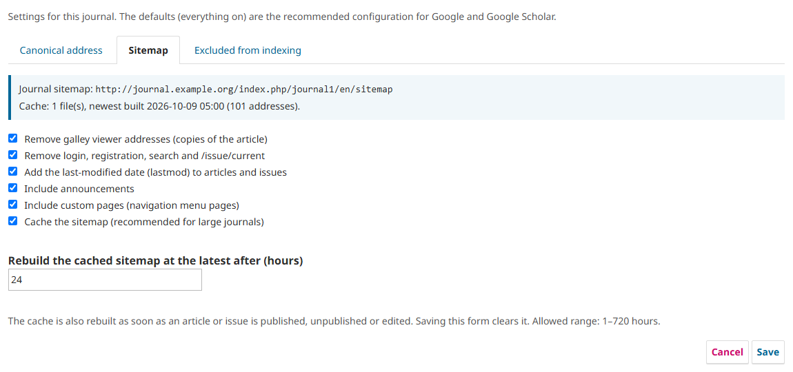
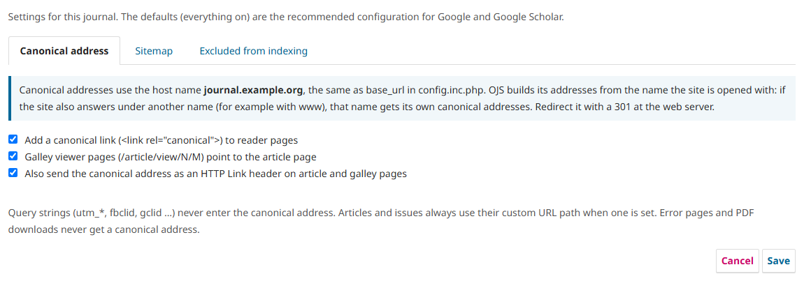

# Canonical URL (canonicalUrl)

[Türkçe](README_TR.md)

An OJS generic plugin by OJS Services that gives every reader-facing page one canonical address, keeps thin pages out of
search indexes and serves a clean, cached journal sitemap. It uses hooks only: no core or theme file is changed, so it
survives OJS upgrades.

| Package | For | Tested on |
|---|---|---|
| `canonicalUrl-ojs3.3-<version>.tar.gz` | OJS 3.3 | OJS 3.3.0.22 with PHP 7.4, 8.1 and 8.2 |
| `canonicalUrl-ojs3.4-3.5-<version>.tar.gz` | OJS 3.4 and 3.5 | OJS 3.4.0.3 and 3.4.0.10 with PHP 8.2 (3.4.0.10 also with PHP 8.1); OJS 3.5.0.1 and 3.5.0.3 with PHP 8.2 |

Other 3.3.0.x, 3.4.0.x and 3.5.0.x releases are expected to work but were not tested. The two packages are not
interchangeable: the OJS 3.3 package does not load on OJS 3.4 or 3.5, and the other way round.

## Sitemap

OJS already publishes a sitemap for every journal. The plugin does not build a sitemap of its own: it filters the one
OJS builds, adds dates to it and caches it, so that search engines get a list of the pages worth indexing.

The address stays the same: `https://<your-site>/index.php/<journal>/sitemap`

| In the OJS sitemap | With the plugin | Why |
|---|---|---|
| Article pages | kept, with `lastmod` | |
| Issue pages | kept, with `lastmod`; listed under the custom URL path when the issue has one | the same address as the canonical link |
| Galley viewer addresses (`/article/view/N/M`) | removed | each is a copy of the article page, and its canonical link points to the article |
| Login, registration, search | removed | not content; these pages are `noindex` |
| `/issue/current` | removed | a second address for the newest issue |
| Announcements, custom pages (navigation menu pages) | kept; each group can be left out in the settings | |
| Home page, archive, about pages | kept as they are | |



- **Dates.** OJS writes no `lastmod`. The plugin adds one to every article and issue: the later of its publication date
  and its last modification date, never later than today.
- **Example.** On a test journal with 80 published articles (most with two galleys) and 10 issues, the OJS sitemap listed
  266 addresses; with the plugin it lists 103, and 90 of them carry `lastmod`.
- **Cache.** OJS builds the sitemap on every request, article by article, which takes long on a large journal. The
  plugin stores the finished sitemap and answers later requests from that copy, before OJS builds it again. The copy is
  rebuilt when an article or issue is published, unpublished or edited, when the plugin settings are saved, and at the
  latest after the configured number of hours (default 24). While one request rebuilds it, other requests get the
  previous copy. The response says which case applied: `X-CanonicalUrl-Sitemap: hit | miss | stale`. A cached answer is
  sent with `Cache-Control: public, max-age=3600` and without a session cookie; a `miss` is sent by OJS itself with its
  own headers. The cache can be switched off in the settings.
- **What you need to do.** Add the sitemap to your `robots.txt` (the plugin cannot edit that file):
  `Sitemap: https://<your-site>/index.php/<journal>/sitemap`, and submit the same address under "Sitemaps" in Google
  Search Console. After that it stays up to date on its own.

Filtering, dates, announcements, custom pages and the cache are separate settings; all are on by default. The site-wide
sitemap index of installations with several journals is not changed.

## What it does

**Canonical address**
- Adds `<link rel="canonical">` to reader pages. Galley viewer pages (`/article/view/N/M`), numeric id vs. custom URL path,
  and any query string (`utm_*`, `fbclid`, …) all resolve to the one article address.
- Sends the same address as an HTTP `Link: <…>; rel="canonical"` header on article and galley viewer pages.
- Never adds a canonical address to error pages (404, 403) or to file downloads (`/article/download/…`).
- The home page has one address: `/<journal>/index` and `/<journal>/index/index` point to `/<journal>`.
- One canonical link per page: if the theme, another plugin or the journal's custom tags already print a canonical link,
  the plugin leaves out its own (and its `Link` header when the two addresses differ) and says so on its settings page.
- Google Scholar: the canonical address is the same address as `citation_abstract_html_url`, also with a custom URL path
  and with `restful_urls`. On OJS 3.5 journals with more than one language, OJS writes that tag without the language code
  (`/<journal>/article/view/N`, which redirects to the reader's language); the canonical address is the page in the
  language being read (`/<journal>/<language>/article/view/N`).
- Outdated article versions (`/article/view/N/version/P`): OJS itself marks them `noindex` and points to the current
  version; the plugin adds nothing there, so the page keeps exactly one canonical link.
- OJS 3.5 (language code in the address): the `hreflang` alternates point to the same canonical addresses, with
  `x-default` on the journal's primary language.

**Excluded from indexing**
These pages get `noindex, follow` instead of a canonical address. The list is fixed:

| Address under the journal | What it covers | `noindex` sent as |
|---|---|---|
| `search`, `search/…` | search form and every result page | meta tag + `X-Robots-Tag` header |
| `login`, `login/…` | sign in, sign out, lost and reset password | meta tag + header |
| `user`, `user/…` | registration, profile, language switch (`user/setLocale`) and other user pages | meta tag + header |
| `notification`, `notification/…` | notifications | meta tag + header |
| `about/aboutThisPublishingSystem` | "About this publishing system" | meta tag + header |
| `citationstylelanguage/…` | citation format downloads (many addresses per article) | header only |

Everything else stays indexable, including the issue archive and its further pages (`issue/archive/2` …) and
announcements. The two settings switch the first five rows and the last row on or off as a whole.

## Installation

1. Website Settings > Plugins > Upload a New Plugin, choose the package for your OJS version.
   Or on the server:
   ```
   tar xzf canonicalUrl-ojs<line>-<version>.tar.gz -C plugins/generic/
   php lib/pkp/tools/installPluginVersion.php plugins/generic/canonicalUrl/version.xml
   ```
2. Enable it: Plugins > Generic Plugins > Canonical URL.
3. Add the sitemap to your `robots.txt` (the plugin cannot edit that file):
   `Sitemap: https://<your-site>/index.php/<journal>/sitemap`

Upgrading the plugin: install the new package the same way (or use "Upgrade" in the plugin list), then clear the OJS
cache (`cache/fc-*.php`, `cache/t_compile/*`; on OJS 3.5 also `cache/opcache/*`). Settings are kept.

### Upgrading OJS from 3.3 to 3.4 or 3.5

The OJS 3.3 package does not load on OJS 3.4 or 3.5. If it is still in `plugins/generic/canonicalUrl` after the OJS
upgrade, the site keeps working, but the plugin is not loaded: pages have no canonical link, the sitemap is the plain
OJS sitemap, and the PHP error log shows `Call to undefined function import()` for the plugin file.

1. After upgrading OJS, install the `canonicalUrl-ojs3.4-3.5` package (upload it, or unpack it into `plugins/generic/`).
   Unpacking over the old folder works; removing the old folder first leaves no unused files behind.
2. Clear the OJS cache as above.

The plugin stays enabled and its settings are kept; they are stored in the database under the same plugin name.

## Settings



Plugins > Generic Plugins > Canonical URL > Settings (Journal Manager or Site Administrator; one set of settings per
journal). Everything is on by default, which is the recommended configuration.

| Tab | Setting |
|---|---|
| Canonical address | Canonical link · galley pages point to the article · HTTP `Link` header · host name in use (information, with a warning when it differs from `base_url`) |
| Sitemap | Remove galley addresses · remove login/registration/search/current issue · add `lastmod` · include announcements · include custom pages · cache and cache lifetime (1–720 hours) |
| Excluded from indexing | `noindex` on thin pages · `noindex` header on citation format downloads |

The settings page also reports two conditions, so that nobody has to look on the server:
- the cache folder (`cache/canonicalUrl`) cannot be written (the sitemap is then rebuilt on every request);
- another canonical link was found on the journal's pages (the plugin left out its own there).

Installations with several journals: the settings are per journal. To give the site-wide pages (the site home page) a
canonical address too, also enable the plugin in Administration > Site Settings > Plugins; they use the default
settings. Opened there, the settings page shows the host name information only.

## Notes

- The cache lives in `cache/canonicalUrl/`. The first request after a change takes as long as OJS needs to build the
  sitemap; later requests are answered from the cache. There is one cache file per address the journal is opened
  with (host name; on OJS 3.5 also language), and at most 8 files per journal (or twice the number of journal
  languages, if that is more): the least recently used file is removed first.
- The plugin's own texts (name, description, settings page) are available in English, Turkish and Spanish.
- A path blocked in `robots.txt` is never crawled, so search engines do not see its `noindex`.
- Host name: OJS builds its addresses, and therefore the canonical address, from the host name the site is opened
  with (or from `base_url[<journal>]` when that is set in `config.inc.php`). The plugin does not change the host name.
  If the site answers under two names (with and without `www`), each name gets its own canonical addresses: redirect
  one to the other with a 301 at the web server. The settings page warns when the name in use differs from `base_url`.

## External requests

None. The plugin loads nothing from other servers, in the visitor's browser or on the server, and sends no data
anywhere. It writes only its sitemap cache, into the OJS `cache/canonicalUrl/` folder.

## Support

Developed by OJS Services (https://ojs-services.com). Questions and bug reports: please open an issue in this repository.

## License

GNU General Public License v3. See the `LICENSE` file.
